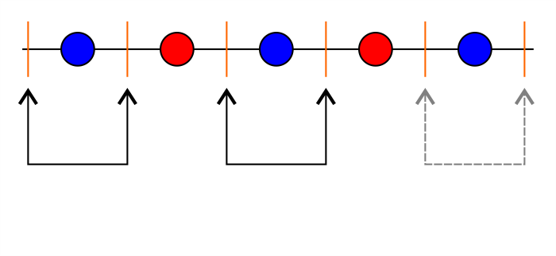

The source code for this notebook can be found [on Github](https://github.com/gmega/learning-from-data/blob/master/hw3).

# Exercises 1-3

Let us start by deriving a general formula as a function of $N$:

$$
2Me^{-2\epsilon^2N} \leq b \iff e^{-2\epsilon^2N} \leq \frac{b}{2M} \iff -2\epsilon^2N \leq \ln\frac{b}{2M} \iff N \geq -\frac{\ln\frac{b}{2M}}{2\epsilon^{2}}
$$

so:

```{r}
min_n <- function(epsilon, M, b) -(log(b/(2*M)))/(2*epsilon**2)
```

## Exercise 1
```{r}
min_n(epsilon = 0.05, b = 0.03, M = 1)
```

Answer $b$.

## Exercise 2
```{r}
min_n(epsilon = 0.05, b = 0.03, M = 10)
```

Answer $c$.

## Exercise 3

```{r}
min_n(epsilon = 0.05, b = 0.03, M = 100)
```

Answer $d$.

# Exercise 4

Fig. \@ref(fig:shattering)(a) shows the dichotomy, made of $4$ non-collinear points, that the $2D$ perceptron cannot separate. To make this separable in $3$ dimensions, we simply shift two of the points off-plane (Fig. \@ref(fig:shattering) (b)). This means that the breakpoint for the $3D$ perceptron is therefore at least $5$. 

```{r shattering, fig.align='center', echo=FALSE, fig.height=2, out.width='400px', fig.cap='$4$ point dichotomies in $2$ and $3$ dimensions.'}

```

We will now demonstrate that no configuration of $5$ points can be shattered by a $3D$ perceptron, making its breakpoint effectively $5$.

Suppose we had a set of $5$ points that we would like to shatter with a $3D$ perceptron. Clearly, no $4$-point subset of these $5$ points should be coplanar, as otherwise it is trivially true that the set cannot be shattered. 

The first point to note is that it is always the case that we can select some $4$-point subset out of our $5$ points and construct a tetrahedron such that the remaining point lays outside of it. This is shown in Fig. \@ref(fig:shattering-2): to construct such a tetrahedron, we can start from any subset of $4$ points (Fig. \@ref(fig:shattering-2) (a)) and, if the remaining point happens to lay inside, make it so that the point inside becomes part of a new tetrahedron, which will then (necessarily) exclude one of the other points (Fig. \@ref(fig:shattering-2)(b)).

Now note that the point that is left outside of the tetrahedron is always contained within the "shadow" cast by of one of its sides. This holds true as the union of the shadows form a partition over the points in $\mathbb{R}^3$ that are located outside of the tetrahedron, meaning $x_4$ (the point left outside) is contained in exactly one of them. This is shown in Fig. \@ref(fig:shattering-2) (c). Denote this side by $T$. Denote the set of points contained in the shadow cast by $T$ as $S_T$ (i.e., $x_4 \in S_T$).

```{r shattering-2, fig.align='center', echo=FALSE, fig.height=2, out.width='600px', fig.cap='(a) Tetrahedron with one point inside, (b) tetrahedron after re-selection, (c) "shadow" cast over point $x_4$. '}
knitr::include_graphics('./images/shattering-2.png')
```

Now consider dichotomies in which we paint $x_2$ red and $x_1$, $x_3$, and $x_5$ blue. Any plane that can separate $x_2$ from $s = \{x_1, x_3, x_5\}$ must place all of the points in $S_T$ into the same semispace as $s$. But this means that $x_4$ must have the same color as the points in $s$; i.e., it must be blue, implying that this set of points cannot be shattered.

The breakpoint for the $3D$ perceptron is therefore $5~\blacksquare$.

This gets us answer $b$.

# Exercise 5

Generalization theory dictates that if some learning model has a breakpoint, then its growth function is bounded by a polynomial. A breakpoint, in turn, is the largest value of $N$ for which the growth function is exactly the same as the upper bound, $2^N$. This implies that valid growth functions must either:

* be equal to $2^N$ for all $N$, or; 
* be polynomials of $N$ which are nevertheless always smaller or equal to $2^N$ for all positive integers (i.e., for function $f$, we must have that $f(N)$ that $f(N) \leq 2^N$ for all positive integers).

We therefore have to check that each of the provided growth functions satisfies these conditions, and rule out those that do not.

**Function (i).** $f_i(N) = N + 1$ is a first order polynomial, and it is always smaller than $2^N$ (I will not prove it, but for $N \geq 2$ it will always be strictly smaller). $f_i$ is therefore a valid growth function.

**Function (ii).** This simplifies to $f_{ii}(N) = \frac{N^2}{2} + \frac{N}{2} + 1$. For small $N$ we get $f_{ii}(1) = 2$, $f_{ii}(2) = 4$, $f_{ii}(3) = 7$. For $N > 3$ we know it will not grow above $2^N$ as it is a quadratic function (second order polynomial), making $f_{ii}$ a valid growth function as well.

**Function (iii).** We know from the [binomial theorem](https://en.wikipedia.org/wiki/Binomial_theorem) that:

$$
2^{\lfloor\sqrt{N}\rfloor} = (1 + 1)^{\lfloor\sqrt{N}\rfloor} = \sum_{i = 0}^{\lfloor\sqrt{N}\rfloor} {{\lfloor\sqrt{N}\rfloor} \choose i}1^{N - i}\cdot1^i = \sum_{i = 0}^{{\lfloor\sqrt{N}\rfloor}} {{\lfloor\sqrt{N}\rfloor} \choose i}
$$

Since $f_{iii}(N)$ is essentially performing the same summation but with positive terms that are larger (for positive integers $i > 0$, $a < b$, we have that ${a \choose i} < {b \choose i}$), it follows that:

$$
f_{iii}(N) = \sum_{i = 1}^{\lfloor\sqrt{N}\rfloor} {N \choose i}\geq \sum_{i = 0}^{\lfloor\sqrt{N}\rfloor} {\lfloor\sqrt{N}\rfloor \choose i} - 1 = 2^{\lfloor\sqrt{N}\rfloor} - 1
$$

$f(N) = 2^{\lfloor\sqrt{N}\rfloor} - 1 < 2^N$ is a non-polynomial function of $N$ (I will not prove this) which is smaller than $2^N$ for $N \geq 1$. $f_{iii}$ is not, therefore, a valid growth function.

**Function (iv).** This is also trivially not a valid growth function, as it is not polynomial in $N$, but at the same time it is smaller than $2^N$ for $N \geq 1$ ($\lfloor N/2 \rfloor < N$ for $N \geq 2$)

**Function (v).** Trivially valid, as it is equal to $2^N$.

We therefore get that $i$, $ii$ and $v$ are valid growth functions, which yields answer $b$.

# Exercise 6

$2$ intervals can separate patterns in which the colors for the adjacent points in the sample do not "flip" more than three times. With $4$ points this is impossible, but as soon as we add the $5^{th}$ point we are able to construct the required pattern \@ref(fig:2-intervals-breakpoint). 

The breakpoint for $2$-intervals is, therefore, $5$, yielding answer $c$.

```{r 2-intervals-breakpoint, echo=FALSE, fig.align='center', out.width='400pt', fig.cap='A pattern that $2$-intervals cannot generate.'}

```

# Exercise 7

To compute this, it is useful to break down the resulting discrete intervals in two cases: overlapping and non-overlapping.

**Case 1 (overlapping).** When intervals are allowed to overlap, the problem is reduced to $1$ intervals, and we know that there are ${N + 1 \choose 2}$ patterns with can be generated on $N$ points by such intervals.

**Case 2 (non-overlapping).** Selecting any $4$ bars in Fig. \@ref(fig:2-intervals) will generate a distinct pair of non-overlapping intervals, and thus a different pattern in the underlying points. This means that non-overlapping intervals can generate an extra ${N + 1 \choose 4}$ patterns

```{r 2-intervals, fig.align='center', echo = FALSE, out.width='500pt', fig.cap='Non-overlapping intervals.'}

```

This yields the growth function:
$$
m_{\mathcal{H}}(N) = {N + 1 \choose 2} + {N + 1 \choose 4} + 1
$$
Where the $+ 1$ comes from the degenerate case, which must be counted separately, that arises when neither interval contain any of the points in our set. 

Therefore alternative $c$.

# Exercise 8

Taking a hint from Fig. \@ref(fig:2-intervals-breakpoint), we see that in order to construct a pattern that $M$-intervals cannot generate, we need $M + 1$ color flips. Each color flip requires two points to be lined up, which would add up to $2M + 2$. The last flip, however, requires only one point as we will not be doing any more flips after it. We therefore require $2M + 1$ points, or answer $d$.

# Exercise 9

We start by arguing that any point configuration with more than $3$ points and that can be shattered by a triangle _must_ be composed of points that lay along a convex hull. Otherwise, we can trivially generate dichotomies that cannot be separated by taking the convex hull of these points, assigning $+1$ to points that are on the convex hull, and $-1$ to points that are not.

With that out of the way, it is not hard to see that separating points along a convex hull with a triangle reduces to $3$-intervals with a twist: namely, that the "last" point becomes adjacent to the first, so that sets with $7$ points can now be shattered (Fig. \@ref(fig:triangle-shatter)(a)).

```{r triangle-shatter, echo=FALSE, fig.align='center', out.width='700pt', fig.cap='(a) Shattering a $7$-point set with a triangle, (b) valid region for $x_3$, (c) the narrowest selection triangle which makes $x_3$ blue.'}

```

Assume now, without loss of generality, that we wished to introduce an $8^{th}$ point between the two adjacent red points $x_1$ and $x_2$. We will demonstrate that if $x_1$ and $x_2$ are red, then either: _i)_ $x_3$ is also red, or _ii)_ $x_3$ is not a part of a the convex hull. Either way, an $8$-point set cannot be shattered with a triangle.

**Proof.** Suppose we wanted our newly-added $x_3$ point to be blue. We must therefore place $x_3$ outside of the decision triangle. However, since the interior angles in a convex hull cannot be larger than $180^{\circ}$, it must be the case that $x_3$ is contained within the small orange triangle of Fig. \@ref(fig:triangle-shatter)(b). That small triangle, however, is entirely composed of red points as it lays entirely within our decision triangle.

To get $x_3$ to be blue, therefore, we must make it so that the decision triangle intercepts the orange triangle, leaving at least one point out for us to pick as our $x_3$ while keeping, of course, all of the other points as they are. 

But we see that this is not possible. Informally: in order to intercept the orange triangle while keeping $x_1$ and $x_2$ inside, we must "squash" the decision triangle so much that we also also scoop both $x_5$ and $x_6$ in, turning them red (Fig. \@ref(fig:triangle-shatter)(c)). It therefore follows that either $x_3$ must be red, or it must be outside of the convex hull. The $8$-point set cannot be shattered. $\blacksquare$

The biggest set we can shatter, then, is a set of size $7$, giving us answer $d$.

# Exercise 10
Concentric circles are akin to $1$-intervals (where $a$ and $b$ mark interval boundaries). Despite being bidimensional, the fact that we must expand the circles in every direction by exactly the same amount means that the number of degrees of freedom in the problem is essentially the same. The number of dichotomies we can generate, therefore, is given by ${N + 1\choose 2} + 1$, or answer $b$.